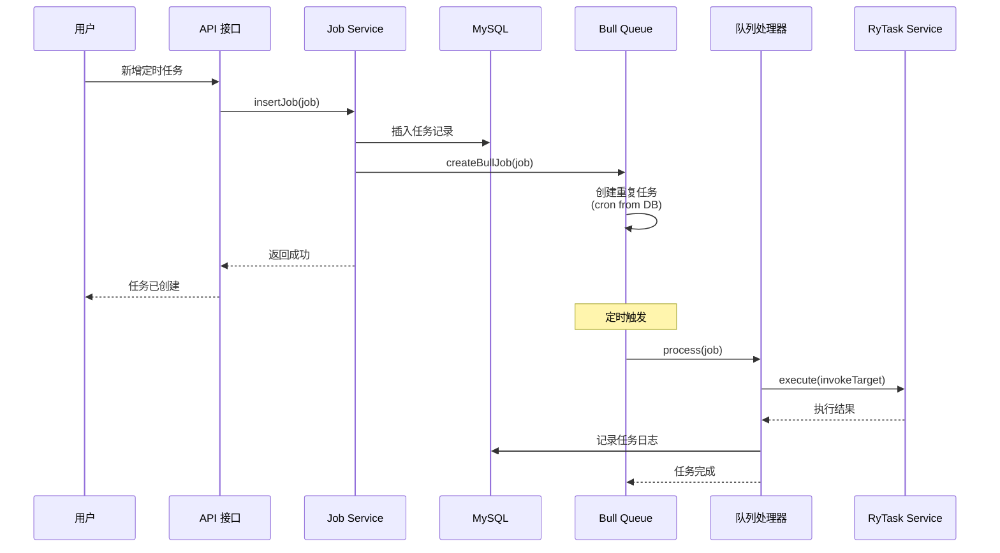

# 使用 egg-bull 实现动态定时任务

## 概述

本项目使用 [egg-bull](https://github.com/hackycy/egg-bull) 实现定时任务的动态配置和手动调用。egg-bull 基于 Bull（Redis 队列）提供强大的任务调度能力。

## 核心特性

✅ **动态配置**：从数据库读取 cron 表达式，无需重启即可更新  
✅ **手动调用**：支持立即执行任务  
✅ **失败重试**：自动重试失败的任务  
✅ **任务日志**：自动记录任务执行日志  
✅ **分布式支持**：基于 Redis，天然支持分布式环境  
✅ **可视化监控**：可集成 Bull Board 进行可视化监控  

---

## 配置

### 1. 安装依赖

```bash
npm install egg-bull --save
```

### 2. 启用插件

**文件**：`config/plugin.js`

```javascript
exports.bull = {
  enable: true,
  package: "egg-bull",
};
```

### 3. 配置 Redis

**文件**：`config/config.default.js`

```javascript
config.bull = {
  client: {
    port: 6379,
    host: "127.0.0.1",
    password: "",
    db: 0,
  },
  // 默认队列配置
  default: {
    attempts: 3,  // 失败重试 3 次
    backoff: {
      type: "fixed",
      delay: 5000,  // 重试间隔 5 秒
    },
    removeOnComplete: true,  // 移除已完成的任务
    removeOnFail: 100,       // 保留最近 100 个失败任务
  },
};
```

---

## 队列处理器

### 创建处理器

**文件**：`app/queue/ryTask.js`

```javascript
module.exports = app => {
  return {
    /**
     * 任务处理器
     */
    async process(job) {
      const { ctx } = this;
      const { invokeTarget, jobInfo } = job.data;
      
      ctx.logger.info(`[Bull] 开始执行任务: ${jobInfo.jobName}`);
      
      // 调用 ryTask 服务执行任务
      const result = await ctx.service.ryTask.execute(invokeTarget);
      
      // 记录任务日志
      await ctx.service.monitor.jobLog.insertJobLog({
        jobName: jobInfo.jobName,
        jobGroup: jobInfo.jobGroup,
        invokeTarget: invokeTarget,
        jobMessage: result.message,
        status: '0',
        createTime: ctx.helper.formatDate(new Date()),
      });
    },

    /**
     * 任务完成事件
     */
    async onCompleted(job, result) {
      const { ctx } = this;
      ctx.logger.info(`[Bull] 任务完成: ${job.data.jobInfo.jobName}`);
    },

    /**
     * 任务失败事件
     */
    async onFailed(job, err) {
      const { ctx } = this;
      ctx.logger.error(`[Bull] 任务失败: ${job.data.jobInfo.jobName}`, err);
    },
  };
};
```

---

## 服务层集成

### 创建 Bull 任务

```javascript
// app/service/monitor/job.js

/**
 * 使用 Bull 创建定时任务
 */
async createBullJob(job) {
  const { app, ctx } = this;
  
  const jobKey = `${job.jobId}_${job.jobGroup}`;
  
  // 添加重复任务
  await app.queue.ryTask.add(
    jobKey,
    {
      invokeTarget: job.invokeTarget,
      jobInfo: {
        jobId: job.jobId,
        jobName: job.jobName,
        jobGroup: job.jobGroup,
      },
    },
    {
      repeat: {
        cron: job.cronExpression,  // 从数据库读取的 cron 表达式
      },
    }
  );
  
  ctx.logger.info(`[Bull] 创建任务: ${job.jobName} (${job.cronExpression})`);
}
```

### 更新 Bull 任务

```javascript
/**
 * 使用 Bull 更新定时任务
 */
async updateBullJob(newJob, oldJob) {
  // 1. 删除旧任务
  await this.deleteBullJob(oldJob);
  
  // 2. 创建新任务
  if (newJob.status === "0") {
    return await this.createBullJob(newJob);
  }
}
```

### 删除 Bull 任务

```javascript
/**
 * 使用 Bull 删除定时任务
 */
async deleteBullJob(job) {
  const { app } = this;
  const jobKey = `${job.jobId}_${job.jobGroup}`;
  
  // 获取所有重复任务
  const repeatableJobs = await app.queue.ryTask.getRepeatableJobs();
  
  // 删除匹配的任务
  for (const repeatJob of repeatableJobs) {
    if (repeatJob.name === jobKey) {
      await app.queue.ryTask.removeRepeatableByKey(repeatJob.key);
    }
  }
}
```

### 手动执行任务

```javascript
/**
 * 使用 Bull 立即执行任务
 */
async runBullJob(job) {
  const { app } = this;
  
  // 立即添加任务到队列（不是重复任务）
  await app.queue.ryTask.add(
    `manual_${job.jobId}_${Date.now()}`,
    {
      invokeTarget: job.invokeTarget,
      jobInfo: {
        jobId: job.jobId,
        jobName: job.jobName,
        jobGroup: job.jobGroup,
      },
    },
    {
      removeOnComplete: true,
    }
  );
}
```

---

## 使用示例

### 1. 新增定时任务

**接口**：`POST /api/monitor/job`

```json
{
  "jobName": "数据备份",
  "jobGroup": "DEFAULT",
  "invokeTarget": "ryTask.backupData",
  "cronExpression": "0 0 3 * * *",
  "status": "0"
}
```

**流程**：
1. 插入数据库（`sys_job` 表）
2. 调用 `createBullJob()` 创建 Bull 重复任务
3. Bull 根据 cron 表达式自动调度

### 2. 修改任务（包括 cron 表达式）

**接口**：`PUT /api/monitor/job`

```json
{
  "jobId": 1,
  "cronExpression": "0 */10 * * * *"  // 改为每 10 分钟
}
```

**流程**：
1. 更新数据库
2. 调用 `updateBullJob()` 
3. 删除旧的 Bull 任务
4. 创建新的 Bull 任务（使用新的 cron 表达式）

### 3. 手动执行任务

**接口**：`PUT /api/monitor/job/run`

```json
{
  "jobId": 1
}
```

**流程**：
1. 调用 `runBullJob()`
2. 立即添加任务到队列
3. Bull 立即执行任务

### 4. 暂停/恢复任务

**接口**：`PUT /api/monitor/job/changeStatus`

```json
{
  "jobId": 1,
  "status": "1"  // 0=正常 1=暂停
}
```

**流程**：
- **暂停**：删除 Bull 重复任务
- **恢复**：重新创建 Bull 重复任务

### 5. 删除任务

**接口**：`DELETE /api/monitor/job/:jobIds`

**流程**：
1. 删除数据库记录
2. 删除 Bull 重复任务

---

## 初始化任务

### 应用启动时加载任务

**文件**：`app.js`

```javascript
class AppBootHook {
  async didLoad() {
    // 应用已经启动完毕
  }

  async serverDidReady() {
    // 初始化定时任务
    const ctx = await this.app.createAnonymousContext();
    await ctx.service.monitor.job.initJobs();
  }
}

module.exports = AppBootHook;
```

**执行流程**：
1. 查询数据库中所有 `status = '0'` 的任务
2. 遍历调用 `createBullJob()` 创建 Bull 任务
3. Bull 根据 cron 表达式自动调度

---

## 任务监控

### 查看队列中的任务

```javascript
// 获取所有重复任务
const repeatableJobs = await app.queue.ryTask.getRepeatableJobs();

// 获取等待中的任务
const waiting = await app.queue.ryTask.getWaiting();

// 获取进行中的任务
const active = await app.queue.ryTask.getActive();

// 获取已完成的任务
const completed = await app.queue.ryTask.getCompleted();

// 获取失败的任务
const failed = await app.queue.ryTask.getFailed();
```

### 集成 Bull Board（可视化监控）

```bash
npm install bull-board --save
```

**配置**：

```javascript
// app/router.js
const { BullAdapter } = require('bull-board');
const { router } = require('bull-board/bull-board');

module.exports = app => {
  const { router, controller } = app;
  
  // Bull Board 可视化监控
  router.all('/admin/queues(.*)', router);
};
```

访问 `http://localhost:7001/admin/queues` 查看任务监控面板。

---

## 工作流程



---

## 与 node-schedule 对比

| 特性 | node-schedule | egg-bull |
|------|--------------|----------|
| **基础** | 内存调度 | Redis 队列 |
| **分布式** | ❌ 不支持 | ✅ 支持 |
| **持久化** | ❌ 重启丢失 | ✅ Redis 持久化 |
| **失败重试** | ❌ 需自己实现 | ✅ 内置重试 |
| **监控** | ❌ 无 | ✅ Bull Board |
| **性能** | 轻量 | 依赖 Redis |
| **复杂度** | 简单 | 中等 |

**推荐**：
- **单机环境**：node-schedule 即可
- **分布式环境**：egg-bull 更合适
- **需要监控/重试**：egg-bull

---

## 常见问题

### Q1: Redis 连接失败？

**A**: 检查 Redis 配置和服务状态：

```bash
# 检查 Redis 是否运行
redis-cli ping

# 应返回 PONG
```

### Q2: 任务没有执行？

**A**: 检查以下几点：
1. Redis 是否运行
2. 任务状态是否为"正常"（status = '0'）
3. cron 表达式是否正确
4. 查看日志：`logs/ruoyi-eggjs/egg-web.log`

### Q3: 如何查看任务执行历史？

**A**: 查询 `sys_job_log` 表：

```sql
SELECT * FROM sys_job_log 
WHERE job_name = '任务名称'
ORDER BY create_time DESC 
LIMIT 10;
```

### Q4: 任务执行失败如何重试？

**A**: Bull 自动重试，配置在 `config.bull.default.attempts`：

```javascript
config.bull = {
  default: {
    attempts: 3,  // 失败后重试 3 次
    backoff: {
      type: "fixed",
      delay: 5000,  // 每次重试间隔 5 秒
    },
  },
};
```

### Q5: 如何手动清理失败的任务？

**A**: 

```javascript
// 清理失败任务
const failed = await app.queue.ryTask.getFailed();
await Promise.all(failed.map(job => job.remove()));

// 清理已完成任务
const completed = await app.queue.ryTask.getCompleted();
await Promise.all(completed.map(job => job.remove()));
```

---

## 最佳实践

### 1. cron 表达式验证

```javascript
const CronUtils = require('./util/cronUtils');

// 新增/修改任务时验证
if (!CronUtils.isValid(job.cronExpression)) {
  throw new Error('Cron 表达式不正确');
}
```

### 2. 任务超时控制

```javascript
await app.queue.ryTask.add(
  jobKey,
  jobData,
  {
    timeout: 60000,  // 60 秒超时
    repeat: { cron: cronExpression },
  }
);
```

### 3. 任务优先级

```javascript
await app.queue.ryTask.add(
  jobKey,
  jobData,
  {
    priority: 1,  // 数字越小优先级越高
    repeat: { cron: cronExpression },
  }
);
```

### 4. 错误处理

```javascript
async process(job) {
  try {
    await this.doTask();
  } catch (err) {
    // 记录错误
    ctx.logger.error('[Bull] 任务执行失败', err);
    
    // 发送告警（可选）
    await ctx.service.notification.sendAlert(err);
    
    throw err;  // 抛出让 Bull 重试
  }
}
```

---

## 总结

使用 egg-bull 实现定时任务的优势：

✅ **动态配置**：从数据库读取 cron 表达式  
✅ **无需重启**：修改任务配置立即生效  
✅ **手动调用**：支持立即执行任务  
✅ **分布式友好**：基于 Redis，天然支持集群  
✅ **失败重试**：自动重试失败的任务  
✅ **可视化监控**：可集成 Bull Board  

相比 node-schedule，egg-bull 更适合生产环境的分布式任务调度！🚀

---

## 相关链接

- [egg-bull 文档](https://github.com/hackycy/egg-bull)
- [Bull 文档](https://github.com/OptimalBits/bull)
- [Bull Board 可视化](https://github.com/felixmosh/bull-board)
- [Cron 表达式说明](https://crontab.guru/)
